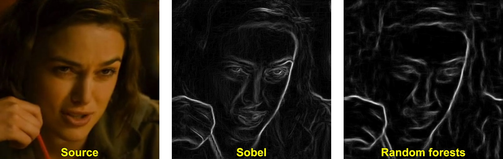
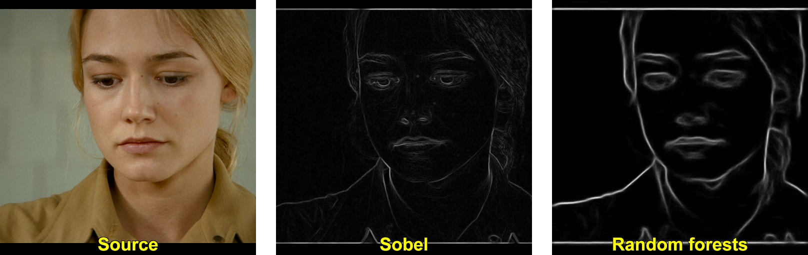

My GSoC working repository 
--------------------------

...

1. Piotr Dollár, C. Lawrence Zitnick, Structured forests for fast edge detection, ICCV, 2013
2. J. J. Lim, C. L. Zitnick, P. Dollár, Sketch Tokens: A Learned Mid-level Representation for Contour and Object Detection, CVPR, 2013